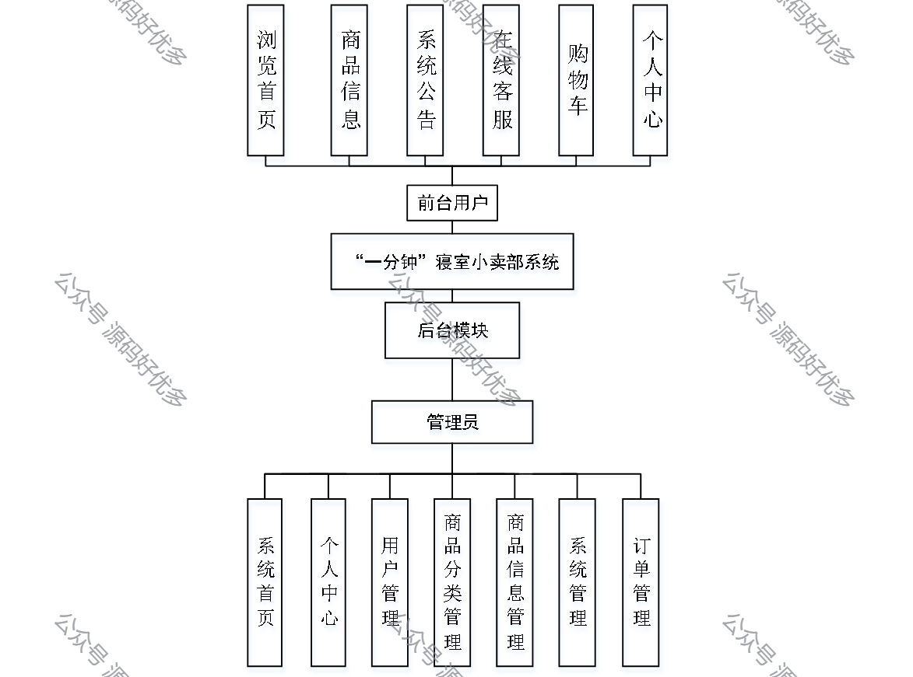

 
## 查看主页获取源码

> **作者介绍**： **✌**全网粉丝10W+本平台特邀作者、博客专家、CSDN新星计划导师、java领域优质创作者,博客之星、掘金/华为云/阿里云/InfoQ等平台优质作者、专注于项目实战 **✌**

  

### 一、作品包含

源码+数据库+设计文档万字+PPT+全套环境和工具资源+部署教程

### 二、项目技术

前端技术：Html、Css、Js、Vue、Element-ui

数据库：MySQL

后端技术：Java、Spring Boot、MyBatis

  

### 三、运行环境

开发工具：IDEA/eclipse

数据库：MySQL5.7

数据库管理工具：Navicat10以上版本

环境配置软件： JDK1.8+Maven3.6.3

前端Nodejs：14

### 四、项目介绍
项目编号：springbootA130

寝室小卖部系统，作为校园便捷生活服务的重要组成部分，以其贴近学生生活的特色，满足了广大在校生日常零食、生活用品的即时需求。该系统通过线上下单、线下配送的模式，有效节省了学生购物的时间，同时也为寝室创业者提供了一个高效的管理平台，推动了校园微型创业生态的繁荣发展。

前台用户功能：首页、商品信息、系统公告、在线客服、购物车、个人中心。

后台管理员的功能：系统首页、个人中心、用户管理、商品分类管理、商品信息管理、系统管理和订单管理。

### 五、运行截图

  
